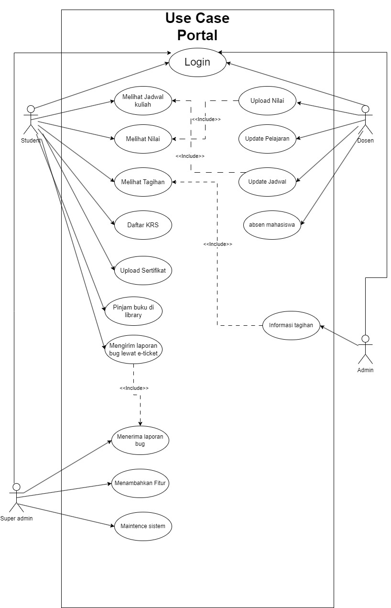
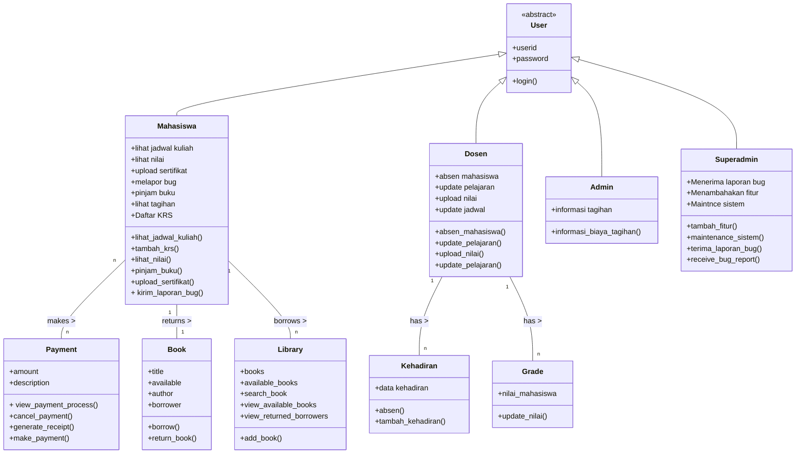

# UTS_PBO_Steven_Wijaya

***Functionality***

Capability: Sistem harus bisa digunakan oleh setiap role yang berbeda seperti mahasiswa (bisa melihat nilai, melihat pembelajaran), dosen (upload nilai, upload materi), admin (Menginformasikan tagihan), superadmin (Maintence sistem, update fitur)

Reusability: Komponen seperti autentikasi pengguna, pengambilan data, dan layanan notifikasi harus dirancang untuk digunakan kembali di berbagai modul.

Security: Otentikasi pengguna, enkripsi data, dan kontrol akses sangat penting. Nilai mahasiswa, tagihan, data seperti ini harus di kelola dengan aman.

***Usability***

Human Factors: tampilan user interface nya harus responsif untuk digunakan oleh semua device yang berbeda, mengakomodasi beragam  teknologi.

Consistency: sistem harus di maintain dengan baik dan harus konsisten agar semua user bisa menggunakan dengan baik.

Documentation: Panduan pengguna yang komprehensif untuk setiap peran pengguna, FAQ, dan manual sistem diperlukan.

**Reliability**

Availability: Sistem harus siap 24/7.

Failure Rate & Duration: harus memiliki tingkat gagal yang rendah dan harus diselesaikan dengan cepat.

Predictability: Perilaku sistem dalam menanggapi tindakan pengguna harus dapat diprediksi dan konsisten.

***Performance***

- Speed: Fast Response untuk pertanyaan dan tindakan pengguna.
- Efficiency:Mengeoptimalkan untuk konsumsi sumber daya tanpa mengorbankan fungsionalitas
- Resource Consumption: Harus dioptimalkan agar berfungsi dengan lancar pada perangkat keras institusional standar.
- Scalability: Mampu menangani peningkatan jumlah data dan pengguna.

***Supportability***

- Testability: Sistem harus mudah untuk di uji untuk menemukan dan memperbaiki bug - bug yang masih ada.
- Extensibility: Sistem harus di design mudah  untuk melakukan  update, penambahan  fitur dengan mudah .
- Serviceability: Masalah dalam sistem harus mudah didiagnosis dan di fix.
- Configurability: pengizinan konfigurasi fitur yang mudah seperti peran pengguna, izin, dan pengaturan sistem.

# ***Use Case and User Stories***

User Roles (Actor)

1. mahasiswa
1. dosen
1. admin
1. super admin

***User Stories*** 

1. Mahasiswa
- lihat jadwal kuliah
- lihat nilai
- Daftar KRS
- upload sertifikat
- melapor bug
- pinjam buku

2. Dosen
- absen mahasiswa
- upload nilai
- update pelajaran
- update jadwal
 
3. Admin
- menampilkan informasi tagihan

4. superadmin
- tambah fitur
- maintence sistem
- menerima laporan bug dari mahasiswa

### **Use Case Diagram & Class Diagram**

